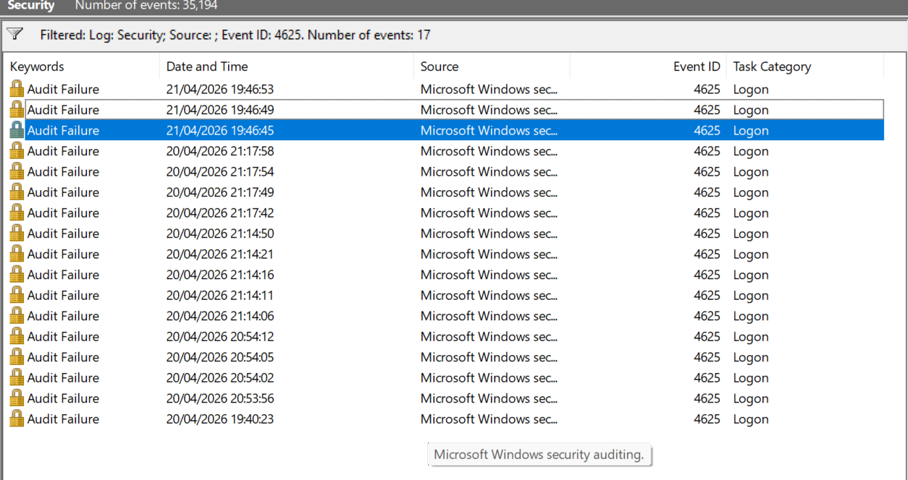

# SOC Project 2 — Failed Login Analysis (Brute Force Detection)

## 📌 Overview
This project focuses on analyzing Windows Security logs to detect failed login attempts and identify potential brute force activity.

## 🛠️ Tools Used
- Event Viewer (Windows)
- Virtual Lab Environment

## 🎯 Objective
- Monitor failed login events
- Identify patterns in authentication failures
- Differentiate between normal behavior and suspicious activity

## 🔍 Investigation Steps
1. Opened Event Viewer
2. Navigated to Windows Logs → Security
3. Filtered logs using Event ID 4625 (Failed Logon)
4. Reviewed multiple log entries
5. Analyzed timestamps, frequency, and account behavior

## 📊 Findings
- Multiple failed login attempts were observed
- Attempts were limited in number and spread over time
- Targeted a single user account

## Evidence
The screenshot below shows multiple failed login attempts (Event ID 4625) within a short time frame.
 

## 🧠 Analysis & Interpretation

Two failed login attempts (Event ID 4625) were observed within a short time frame targeting a single user account.

The activity appears limited in frequency and does not demonstrate characteristics of a brute force attack, such as high-volume or rapid repeated attempts.

This behavior is likely attributed to normal user activity, such as incorrect password entry.

No indicators of compromise (IOC) were identified during the analysis.

However, continued monitoring is recommended to detect any potential escalation or abnormal login patterns.

## 🧾 Conclusion
The observed activity appears to be normal user behavior rather than a brute force attack. No signs of compromise were detected.

Continuous monitoring is recommended to ensure no escalation occurs.

## 📚 Skills Demonstrated
- Log Analysis
- Threat Detection
- Security Monitoring
- Analytical Thinking
- Incident Documentatio
